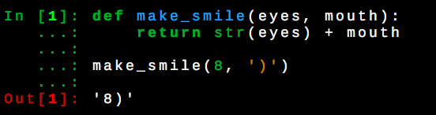

### Get set up

- Install [bash][bash] if on Windows
- Install [git][git] if on Mac or Linux
- Install [conda][conda] on Windows, Mac, or Linux

[bash]: https://github.com/thejohnhoffer/ready/wiki/bash-git-python#bash
[git]: https://github.com/thejohnhoffer/ready/wiki/bash-git-python#git
[conda]: https://github.com/thejohnhoffer/ready/wiki/bash-git-python#conda

### Get the code

In a `bash` prompt, type this:

```
git clone https://github.com/thejohnhoffer/ready.git
cd ready
```

Now you're in a folder that contains this project.


### Notes

A `$` means you're in a `bash` prompt, like this:

```
laptop:ready John$
```

In `bash`, you type `ipython` to enter `ipython`. Something like `In [1]:` means you're in an `ipython` prompt. You can type `exit()` to leave `ipython`. Then you'll be returned to your `bash` prompt. You can also just close the window or `bash` application.

You'll notice `ipython` has colors to help you remember the meaning of symbols:

In this image:
- Green:
    - numbers
    - your input prompt
    - standard python [keywords](https://github.com/thejohnhoffer/ready/wiki/keywords)
    - standard python [functions](https://docs.python.org/3/library/functions.html)
- Red:
    - your output
- Orange:
    - strings
- Blue:
    - function defintions
- Pink:
    - string format [placeholders](https://pyformat.info/#simple)
- Gray:
    - variables and symbols 

### Run the code from bash

One option is to run python directly in a `bash` prompt like this:

```
python test.py
```


### Run the code from ipython

Or, you can run python interactively. In a `bash` prompt, type this:

```
ipython
```

Then, from the `ipython` prompt, type this:

```
In [1]: import read

In [2]: read.files('single_spaced.txt', 'double_spaced.txt')
``` 

If you open [test.py](test.py), you'll notice these two lines.
